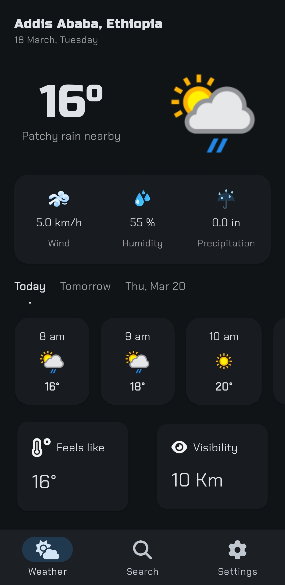
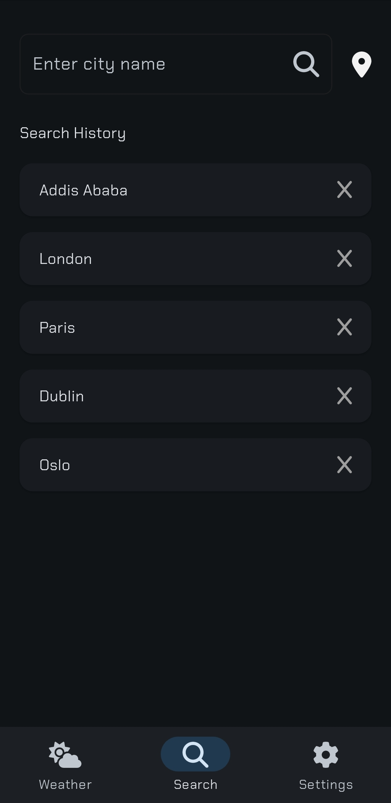
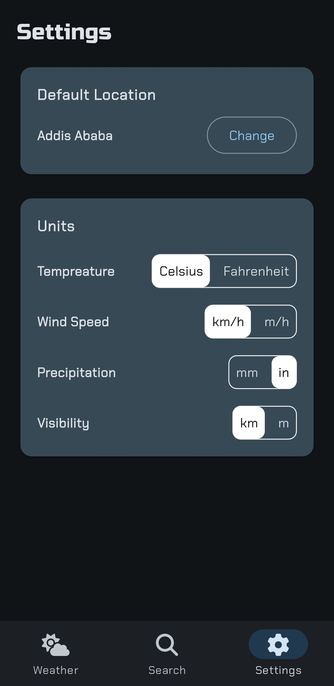

# Weather app

A weather application developed using Flutter and BLoC for state management. This app retrieves real-time weather data based on the user's location or any specified city and presents it through a clean and intuitive user interface.

## Features

- **Real-time Weather Updates**: Get accurate and up-to-date weather information for your current location or any city of your choice.
- **Detailed Weather Insights**: Displays temperature, humidity, wind speed, and atmospheric conditions.
- **User-Friendly Interface**: A clean and modern design.

## API

To use the app, obtain an API key from [weatherapi.com](https://www.weatherapi.com/)

## Screenshots

|                                           |                                           |                                           |
| ----------------------------------------- | ----------------------------------------- | ----------------------------------------- |
|  |  |  |

